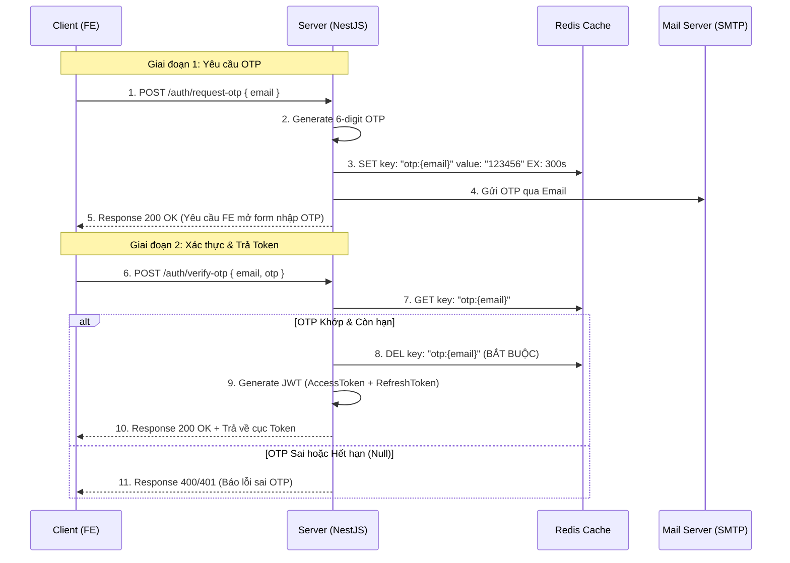

```mermaid
sequenceDiagram
    participant FE as Client (FE)
    participant BE as Server (NestJS)
    participant REDIS as Redis Cache
    participant MAIL as Mail Server (SMTP)

    Note over FE, BE: Giai đoạn 1: Yêu cầu OTP
    FE->>BE: 1. POST /auth/request-otp { email }
    BE->>BE: 2. Generate 6-digit OTP
    BE->>REDIS: 3. SET key: "otp:{email}" value: "123456" EX: 300s
    BE->>MAIL: 4. Gửi OTP qua Email
    BE-->>FE: 5. Response 200 OK (Yêu cầu FE mở form nhập OTP)
    
    Note over FE, BE: Giai đoạn 2: Xác thực & Trả Token
    FE->>BE: 6. POST /auth/verify-otp { email, otp }
    BE->>REDIS: 7. GET key: "otp:{email}"
    
    alt OTP Khớp & Còn hạn
        BE->>REDIS: 8. DEL key: "otp:{email}" (BẮT BUỘC)
        BE->>BE: 9. Generate JWT (AccessToken + RefreshToken)
        BE-->>FE: 10. Response 200 OK + Trả về cục Token
    else OTP Sai hoặc Hết hạn (Null)
        BE-->>FE: 11. Response 400/401 (Báo lỗi sai OTP)
    end

```