# Entity Relationship Diagram (ERD)

## Business Domain Overview
- **Agencies (Companies)**: Multi-tenant entities that configure internal recruiting workflows, custom forms, dynamic inputs, and chaining logic.
- **Staff**: Users who submit resumes, fill custom forms, and apply for jobs.
- **Basic Forms**:
  - **Resume**: Name, Skill, Description (`dynamic_data`)
  - **Job**: Name, Skill, Description (`dynamic_data`)
  - **Staff**: Name, Resume, Job, Company (`dynamic_data`)
  - **Sale**: Name, Resume, Job, Company (`dynamic_data`)
- **Dynamic Form & Chaining Logic System**:
  - Allows agencies to build forms with dynamic fields.
  - Supports dynamic chaining rules (e.g. changing Job alters Sale information by adding/deleting inputs).

---

## Mermaid ERD Diagram

```mermaid
erDiagram

    %% ==========================================
    %% 1. MULTI-TENANT & CORE ENTITIES
    %% ==========================================

    AGENCY {
        uuid id PK
        string name "Agency / Company Name"
        string email "Contact Email"
        datetime created_at
        datetime updated_at
    }

    STAFF {
        uuid id PK
        uuid agency_id FK "Belongs to Agency/Company"
        uuid resume_id FK "Primary Resume reference (nullable)"
        uuid job_id FK "Current / Applied Job reference (nullable)"
        string name "Staff Name"
        string email "Staff Email"
        jsonb dynamic_data "Dynamic fields mapped from core"
        datetime created_at
        datetime updated_at
    }

    %% ==========================================
    %% 2. BASIC RECRUITING FORMS & BUSINESS OBJECTS
    %% ==========================================

    RESUME {
        uuid id PK
        uuid agency_id FK "Belongs to Agency/Company"
        uuid staff_id FK "Submitted by Staff"
        string name "Resume Title / Candidate Name"
        string skill "Skills list / tags"
        text description "Candidate Summary"
        jsonb dynamic_data "Custom dynamic inputs"
        datetime created_at
        datetime updated_at
    }

    JOB {
        uuid id PK
        uuid agency_id FK "Created by Agency/Company"
        string name "Job Title"
        string skill "Required Skills"
        text description "Job Description"
        string status "OPEN, CLOSED, DRAFT"
        jsonb dynamic_data "Custom dynamic inputs"
        datetime created_at
        datetime updated_at
    }

    SALE {
        uuid id PK
        uuid agency_id FK "Agency / Company"
        uuid staff_id FK "Associated Staff / Candidate"
        uuid resume_id FK "Associated Resume"
        uuid job_id FK "Associated Job"
        string name "Sale Deal / Placement Name"
        string status "LEAD, IN_PROGRESS, CLOSED_WON, CLOSED_LOST"
        jsonb dynamic_data "Dynamic inputs modified by Chaining Logic"
        datetime created_at
        datetime updated_at
    }

    JOB_APPLICATION {
        uuid id PK
        uuid agency_id FK
        uuid staff_id FK "Applicant Staff"
        uuid job_id FK "Applied Job"
        uuid resume_id FK "Attached Resume"
        string status "APPLIED, SCREENING, INTERVIEWING, OFFERED, REJECTED"
        jsonb dynamic_data "Application form dynamic data"
        datetime created_at
        datetime updated_at
    }

    %% ==========================================
    %% 3. DYNAMIC FORMS & FIELD DEFINITIONS
    %% ==========================================

    FORM_DEFINITION {
        uuid id PK
        uuid agency_id FK "Agency tenant owner"
        string name "Form Name"
        string form_type "RESUME, JOB, STAFF, SALE, CUSTOM"
        text description "Form Description"
        boolean is_active
        datetime created_at
        datetime updated_at
    }

    FIELD_DEFINITION {
        uuid id PK
        uuid form_id FK "Belongs to Form"
        string field_key "Unique field identifier"
        string field_label "UI Display Label"
        string field_type "string, number, date, boolean, select, relation"
        boolean is_required
        jsonb options "Validation rules, options for select"
        int order_index "Sort order in UI"
        datetime created_at
        datetime updated_at
    }

    CUSTOM_FORM_SUBMISSION {
        uuid id PK
        uuid agency_id FK
        uuid form_id FK "Form definition reference"
        uuid staff_id FK "Submitted by Staff (nullable)"
        jsonb dynamic_data "User responses mapped from field definitions"
        datetime created_at
    }

    %% ==========================================
    %% 4. DYNAMIC CHAINING LOGIC ENGINE
    %% ==========================================

    CHAINING_LOGIC {
        uuid id PK
        uuid agency_id FK "Configured by Agency"
        uuid source_form_id FK "Source form triggering the change"
        uuid source_field_id FK "Source input field (nullable for form-level)"
        uuid target_form_id FK "Target form affected (e.g. SALE)"
        uuid target_field_id FK "Target input field to add/remove/modify"
        string trigger_event "ON_CHANGE, ON_SELECT, ON_SUBMIT"
        string action_type "ADD_FIELD, DELETE_FIELD, SET_VALUE, SHOW_FIELD, HIDE_FIELD"
        jsonb condition_rule "Rule criteria (e.g. operator, values)"
        jsonb action_payload "Schema/field mutation config"
        datetime created_at
        datetime updated_at
    }

    %% ==========================================
    %% RELATIONSHIPS
    %% ==========================================

    %% Agency Relationships
    AGENCY ||--o{ STAFF : "employs / manages"
    AGENCY ||--o{ RESUME : "manages"
    AGENCY ||--o{ JOB : "creates / publishes"
    AGENCY ||--o{ SALE : "manages"
    AGENCY ||--o{ JOB_APPLICATION : "receives"
    AGENCY ||--o{ FORM_DEFINITION : "builds dynamic forms"
    AGENCY ||--o{ CHAINING_LOGIC : "defines chaining logic"
    AGENCY ||--o{ CUSTOM_FORM_SUBMISSION : "manages submissions"

    %% Staff Relationships
    STAFF ||--o{ RESUME : "submits / owns"
    STAFF ||--o{ JOB_APPLICATION : "applies"
    STAFF ||--o{ CUSTOM_FORM_SUBMISSION : "submits"
    STAFF ||--o{ SALE : "linked to deal"

    %% Basic Form Relationships & Linking
    JOB ||--o{ JOB_APPLICATION : "receives applications"
    JOB ||--o{ SALE : "relates to sale"
    RESUME ||--o{ JOB_APPLICATION : "submitted with"
    RESUME ||--o{ SALE : "linked in sale"

    %% Dynamic Form & Field Relationships
    FORM_DEFINITION ||--o{ FIELD_DEFINITION : "contains dynamic inputs"
    FORM_DEFINITION ||--o{ CUSTOM_FORM_SUBMISSION : "defines structure for"

    %% Chaining Logic Relationships
    FORM_DEFINITION ||--o{ CHAINING_LOGIC : "source form trigger"
    FORM_DEFINITION ||--o{ CHAINING_LOGIC : "target form action"
    FIELD_DEFINITION ||--o{ CHAINING_LOGIC : "source field trigger"
    FIELD_DEFINITION ||--o{ CHAINING_LOGIC : "target field mutation"
```

