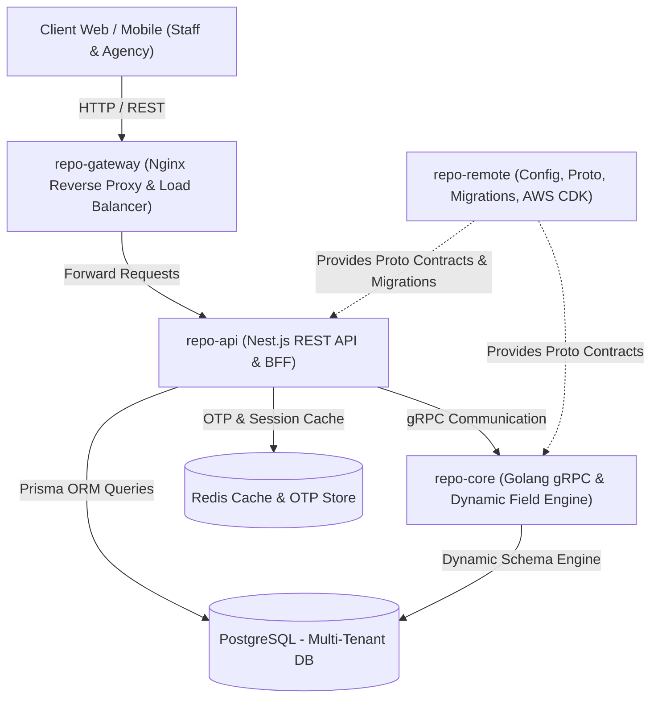

# Microservices Architecture & Step-by-Step Implementation Guide

## 1. System Overview & Architecture Topology

---

## 2. Microservice Responsibilities & Tech Stack

| Service | Technology | Role & Key Responsibilities |
| :--- | :--- | :--- |
| **`repo-remote`** | Docker, Protobuf, Prisma, AWS CDK | Centralized infrastructure: Protobuf contracts (`.proto`), database schemas & migrations, Docker Compose orchestration, AWS CDK IaC. |
| **`repo-core`** | Golang (Gin, gRPC, pgx/GORM) | CRM Core & High-Performance Dynamic Field Engine: Field validation, schema definitions, dynamic chaining logic engine (triggers, rule execution). |
| **`repo-api`** | Nest.js, TypeScript, Prisma, Redis | Business API & BFF: Auth (OTP + JWT), Multi-tenant Agency/Staff management, Form builder, Job applications, Sales pipeline, gRPC client consuming `repo-core`. |
| **`repo-gateway`** | Nginx | API Gateway: Single entry point, SSL termination, reverse proxy, route routing, rate limiting, and CORS handling. |

---

## 3. Step-by-Step Implementation Roadmap

### Phase 1: Shared Infrastructure & Contracts (`repo-remote`)
> **Goal**: Establish the foundational infrastructure, shared contracts, and database models before writing application logic.

#### Step 1.1: Local Environment & Docker Compose Setup
- Create unified `docker-compose.yml` for local development supporting:
  - PostgreSQL (Multi-tenant database)
  - Redis (OTP caching & sessions)
  - Mailhog/Mock SMTP (for local OTP email testing)
- Configure environment variable templates (`.env.example`) for all services.

#### Step 1.2: Centralized Database Schema & Migrations
- Define Prisma/PostgreSQL schema according to the ERD:
  - **Tenant & Identity**: `AGENCY`, `STAFF`
  - **Basic Domain Forms**: `RESUME`, `JOB`, `SALE`, `JOB_APPLICATION`
  - **Dynamic Form Engine**: `FORM_DEFINITION`, `FIELD_DEFINITION`, `CUSTOM_FORM_SUBMISSION`
  - **Chaining Engine**: `CHAINING_LOGIC`
- Setup automated migration scripts and database seeders for basic tenant data and default forms.

#### Step 1.3: Protobuf & gRPC Contracts Definition
- Create `.proto` service definition files for cross-service communication:
  - `field_service.proto`: CRUD and validation for dynamic fields.
  - `form_service.proto`: Form blueprint evaluation and composition.
  - `chaining_service.proto`: Chaining logic resolution (evaluating triggers like `Job -> Sale`).
- Setup automated Protobuf code generation (`protoc`) targets for:
  - Go (`protoc-gen-go`, `protoc-gen-go-grpc`) -> output to `repo-core`
  - TypeScript/Node (`ts-proto` or `@grpc/proto-loader`) -> output to `repo-api`

---

### Phase 2: Core CRM & Dynamic Field Engine (`repo-core` - Golang)
> **Goal**: Build the fast, resilient core service handling dynamic inputs and chaining logic.

#### Step 2.1: Go Project Initialization & gRPC Server Setup
- Initialize Go module with clean architecture (`cmd/server`, `internal/domain`, `internal/service`, `internal/repository`, `proto/`).
- Initialize gRPC server with interceptors for logging, recovery, and tenant context propagation.

#### Step 2.2: Dynamic Field & Blueprint Management Engine
- Implement dynamic field validation engine:
  - Data types: `string`, `number`, `date`, `boolean`, `select`, `relation`, `jsonb`.
  - Custom validation rules (required, min/max length, regex, allowed options).
- Implement dynamic JSON mapping and sanitization for form entity submissions.

#### Step 2.3: Dynamic Chaining Logic Engine
- Implement rule evaluator for dynamic field dependencies:
  - **Trigger Events**: `ON_CHANGE`, `ON_SELECT`, `ON_SUBMIT`.
  - **Action Types**: `ADD_FIELD`, `DELETE_FIELD`, `SET_VALUE`, `SHOW_FIELD`, `HIDE_FIELD`.
  - **Evaluation flow**: When an agency updates or selects a `Job`, the engine evaluates configured `CHAINING_LOGIC` rules and returns the mutated fields/payload required for the target form (e.g. `Sale`).

#### Step 2.4: Core gRPC Handlers & Unit Testing
- Implement gRPC RPC handlers matching the `.proto` definitions.
- Write unit tests for field validator and chaining logic engine with comprehensive edge cases.

---

### Phase 3: Higher Business Layer & BFF (`repo-api` - Nest.js)
> **Goal**: Build the main REST API providing tenant authentication, agency workflows, and form orchestration.

#### Step 3.1: NestJS Setup & Microservices gRPC Client
- Initialize NestJS modular structure (`modules/auth`, `modules/agency`, `modules/staff`, `modules/forms`, `modules/jobs`, `modules/sales`, `modules/grpc-client`).
- Configure `@nestjs/microservices` gRPC Client connected to `repo-core`.

#### Step 3.2: Authentication & Multi-Tenancy Module (OTP + JWT)
- Implement two-stage OTP authentication workflow as per `authentication_diagram.md`:
  1. `POST /auth/request-otp`: Generate 6-digit OTP, store in Redis with 300s TTL, send via email.
  2. `POST /auth/verify-otp`: Validate OTP against Redis, delete key, issue JWT Access & Refresh tokens.
- Implement Tenant Isolation Guard / Interceptor extracting `agency_id` from JWT context.

#### Step 3.3: Form Builder & Dynamic Forms Module
- Implement endpoints for agencies to create and manage custom forms (`FORM_DEFINITION`, `FIELD_DEFINITION`).
- Integrate with `repo-core` via gRPC to validate schema blueprints and execute chaining logic.

#### Step 3.4: Basic Domain Modules (Staff, Resume, Job, Sale)
- **Staff Module**: Staff profile, custom form submissions, job application tracking.
- **Resume Module**: CRUD for resumes (Name, Skill, Description + dynamic data).
- **Job Module**: Job postings (Name, Skill, Description, status + dynamic data).
- **Sale Module**: Deals/placement tracking linking Staff, Resume, Job, and Company with dynamically chained fields.
- **Job Application Module**: Applying to jobs with attached resumes and custom application questions.

#### Step 3.5: Validation, DTOs, & Automated Tests
- Implement DTOs using `class-validator` and `class-transformer`.
- Write unit and integration tests using Jest and Supertest.

---

### Phase 4: API Gateway & Traffic Routing (`repo-gateway` - Nginx)
> **Goal**: Configure Nginx as the single entry point for all external traffic.

#### Step 4.1: Nginx Configuration & Routing
- Configure upstream block pointing to `repo-api`.
- Set up route proxies:
  - `/api/v1/auth/*` -> `repo-api` auth service
  - `/api/v1/agencies/*` -> `repo-api` agency service
  - `/api/v1/staff/*` -> `repo-api` staff service
  - `/api/v1/forms/*` -> `repo-api` form engine
  - `/api/v1/jobs/*` -> `repo-api` job service
  - `/api/v1/sales/*` -> `repo-api` sale service
- Setup `/healthz` endpoint for uptime monitoring.

#### Step 4.2: Security, CORS & Performance Optimization
- Enable gzip compression and HTTP/2.
- Configure CORS headers for approved frontend domains.
- Configure rate limiting per IP (`limit_req_zone`) to protect sensitive endpoints (e.g. OTP request).

---

### Phase 5: End-to-End Workflow Verification
> **Goal**: Validate end-to-end user scenarios across the entire microservice ecosystem.

#### Scenario Checklist:
1. **Tenant Onboarding**: Agency registers and logs in via OTP.
2. **Form Customization**: Agency creates custom fields for `Job` and `Sale`, and sets up a `CHAINING_LOGIC` rule (*Job change -> updates Sale input*).
3. **Job Posting**: Agency posts a new Job.
4. **Staff Application**: Staff requests OTP, logs in, creates Resume, and applies for the Job.
5. **Chained Deal Creation**: Agency creates a `Sale` deal linked to the Job and Staff; verify that dynamic fields are correctly added/evaluated by `repo-core`.

---

### Phase 6: Cloud Deployment & DevOps (`repo-remote` - AWS CDK)
> **Goal**: Production readiness and automated cloud provisioning.

#### Step 6.1: Containerization
- Create optimized multi-stage `Dockerfile` for each service (`repo-gateway`, `repo-api`, `repo-core`).

#### Step 6.2: Infrastructure as Code (AWS CDK)
- Provision AWS infrastructure:
  - VPC with public/private subnets.
  - AWS ECS (Fargate) for container workloads.
  - AWS RDS PostgreSQL with automated backups and multi-AZ.
  - AWS ElastiCache for Redis cluster.
  - AWS Application Load Balancer (ALB) directing traffic to Nginx Gateway.

#### Step 6.3: CI/CD Automation
- Setup GitHub Actions pipelines for:
  - Linting & testing on pull requests.
  - Protobuf contract validation.
  - Automated Docker image build and push to AWS ECR.
  - ECS service deployment and database migration execution on merge.
