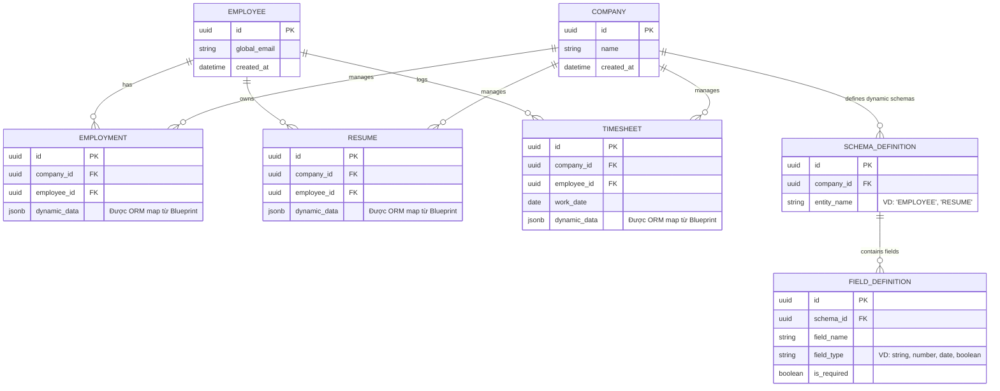

**Diagram:**

```mermaid
erDiagram

%% Core Entities

COMPANY {

uuid id PK

string name

datetime created_at

}

  

EMPLOYEE {

uuid id PK

string global_email

datetime created_at

}

  

%% Pivot table resolving N:N between Company and Employee

EMPLOYMENT {

uuid id PK

uuid company_id FK

uuid employee_id FK

jsonb dynamic_data "Được ORM map từ Blueprint"

}

  

RESUME {

uuid id PK

uuid company_id FK

uuid employee_id FK

jsonb dynamic_data "Được ORM map từ Blueprint"

}

  

TIMESHEET {

uuid id PK

uuid company_id FK

uuid employee_id FK

date work_date

jsonb dynamic_data "Được ORM map từ Blueprint"

}

  

%% Dynamic Schema / Blueprint Metadata

SCHEMA_DEFINITION {

uuid id PK

uuid company_id FK

string entity_name "VD: 'EMPLOYEE', 'RESUME'"

}

  

FIELD_DEFINITION {

uuid id PK

uuid schema_id FK

string field_name

string field_type "VD: string, number, date, boolean"

boolean is_required

}

  

%% Relationships

COMPANY ||--o{ EMPLOYMENT : "manages"

EMPLOYEE ||--o{ EMPLOYMENT : "has"

  

COMPANY ||--o{ RESUME : "manages"

EMPLOYEE ||--o{ RESUME : "owns"

  

COMPANY ||--o{ TIMESHEET : "manages"

EMPLOYEE ||--o{ TIMESHEET : "logs"

  

COMPANY ||--o{ SCHEMA_DEFINITION : "defines dynamic schemas"

SCHEMA_DEFINITION ||--o{ FIELD_DEFINITION : "contains fields"
```