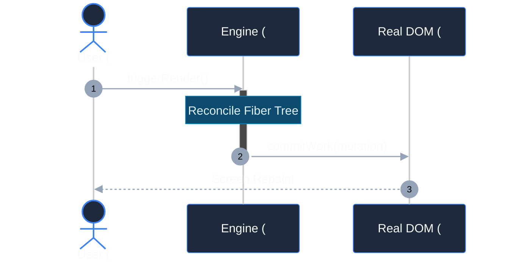
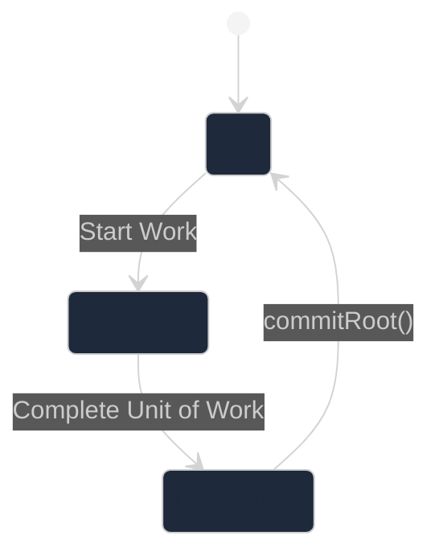

# Mermaid.js Dark Theme Design Skill

This skill enforces dark-theme-first styling across all Mermaid diagrams. Default Mermaid styling often produces black text on dark backgrounds, invisible link arrows, or harsh, glaring white boxes. By applying these standards, every diagram rendered in dark IDEs, GitHub dark mode, or dark documentation remains legible, polished, and visually stunning.

---

## 1. Golden Rules of Dark Theme Mermaid

1. **Always Specify Text Color Explicitly**:
   Whenever defining `fill` in `style` or `classDef`, **always** include an explicit `color:#...`. Never let the text color inherit browser or parser defaults (which default to `#000` or `#333`).
2. **Never Use Dark Connector Lines**:
   Default link arrows (`#333`) vanish on dark canvas backgrounds. Always ensure edges use luminous or neutral-light strokes (`#94a3b8`, `#cbd5e1`, `#38bdf8`).
3. **Use Curated Dark Palettes, Not Pastel/Light Fills**:
   Replace light fills (e.g., `#ffebee`, `#e8f5e9`) with deep, saturated tones (e.g., `#3b111a`, `#064e3b`) paired with light foreground text and vivid border strokes.
4. **Subgraphs Must Have Subtle Dark Containers**:
   Give subgraphs translucent or dark slate fills (`#0f172a`, `#1e293b`) with distinct borders (`#334155`, `#475569`) and bright headers (`#cbd5e1`).

---

## 2. Global Dark Directive (`%%{init}%%`)

For standalone diagrams or markdown documents, place the `init` directive at the very top of the diagram:

```mermaid
%%{init: {
  'theme': 'dark',
  'themeVariables': {
    'darkMode': true,
    'background': '#0f172a',
    'primaryColor': '#1e293b',
    'primaryTextColor': '#f8fafc',
    'primaryBorderColor': '#3b82f6',
    'lineColor': '#94a3b8',
    'secondaryColor': '#0f172a',
    'tertiaryColor': '#1e1e38',
    'mainBkg': '#1e293b',
    'nodeBorder': '#3b82f6',
    'clusterBkg': '#0f172a',
    'clusterBorder': '#334155',
    'titleColor': '#f8fafc',
    'edgeLabelBackground': '#1e293b'
  }
}}%%
```

---

## 3. Dark Mode Palette Matrix (`classDef`)

Always declare these utility classes at the bottom of your flowcharts/graphs:

```mermaid
classDef default fill:#1e293b,stroke:#475569,stroke-width:1.5px,color:#f8fafc;
classDef primary fill:#1e3a8a,stroke:#3b82f6,stroke-width:2px,color:#eff6ff;
classDef success fill:#064e3b,stroke:#10b981,stroke-width:2px,color:#ecfdf5;
classDef warning fill:#78350f,stroke:#f59e0b,stroke-width:2px,color:#fef3c7;
classDef danger  fill:#881337,stroke:#f43f5e,stroke-width:2px,color:#ffe4e6;
classDef accent  fill:#581c87,stroke:#a855f7,stroke-width:2px,color:#faf5ff;
classDef neutral fill:#0f172a,stroke:#334155,stroke-width:1.5px,color:#94a3b8;
classDef info    fill:#0c4a6e,stroke:#0284c7,stroke-width:2px,color:#e0f2fe;
```

### Color Token Reference Table

| Intent | Semantic Meaning | `fill` (Deep) | `stroke` (Vivid) | `color` (Text) |
| :--- | :--- | :--- | :--- | :--- |
| **`primary`** | Main flow, active nodes, current state | `#1e3a8a` | `#3b82f6` | `#eff6ff` |
| **`success`** | Mounts, additions, confirmed, valid | `#064e3b` | `#10b981` | `#ecfdf5` |
| **`warning`** | WIP, pending, yielding, conditional | `#78350f` | `#f59e0b` | `#fef3c7` |
| **`danger`** | Deletions, errors, removals, terminations | `#881337` | `#f43f5e` | `#ffe4e6` |
| **`accent`** | Hooks, transforms, special dispatch | `#581c87` | `#a855f7` | `#faf5ff` |
| **`info`** | Metadata, properties, descriptors | `#0c4a6e` | `#0284c7` | `#e0f2fe` |
| **`neutral`** | Baseline, background boxes, containers | `#0f172a` | `#334155` | `#94a3b8` |

---

## 4. Diagram Recipes

### 4.1 Flowcharts & Graphs

```mermaid
flowchart TD
    %% Global styling
    classDef primary fill:#1e3a8a,stroke:#3b82f6,stroke-width:2px,color:#eff6ff;
    classDef success fill:#064e3b,stroke:#10b981,stroke-width:2px,color:#ecfdf5;
    classDef danger fill:#881337,stroke:#f43f5e,stroke-width:2px,color:#ffe4e6;
    classDef neutral fill:#0f172a,stroke:#334155,stroke-width:1.5px,color:#cbd5e1;

    subgraph Container ["Parent Container (#0f172a)"]
        A["Step 1: Check Type"]:::primary
        B["Step 2: Update Node"]:::success
        C["Step 3: Delete Node"]:::danger
    end

    A -->|"Match"| B
    A -->|"No Match"| C
    style Container fill:#0f172a,stroke:#334155,stroke-width:1.5px
    linkStyle default stroke:#94a3b8,stroke-width:1.5px
```



### 4.2 Sequence Diagrams

In sequence diagrams, configure actors and notes using `themeVariables` or dark note syntax:



### 4.3 State Diagrams (`stateDiagram-v2`)



---

## 5. Anti-Patterns to Strictly Avoid

| Anti-Pattern | Why It Fails | Solution |
| :--- | :--- | :--- |
| `classDef node fill:#ffebee,color:#b71c1c` | Light pastel fill causes jarring glare in dark IDEs and looks bleached. | Use `fill:#881337,stroke:#f43f5e,color:#ffe4e6` |
| `classDef node fill:#1e293b;` (No `color`) | Default text renders as `#000000`, making labels completely unreadable. | Always pair `fill:#1e293b` with `color:#f8fafc` |
| `linkStyle default ... color:#...` or `style ... color:#...` | SVG `<path>` and `<g>` elements do not accept `color`. Throws Mermaid parser error. | Only use `stroke` and `fill` in `style`/`linkStyle`. Use `classDef` for `color`. |
| Unstyled default arrows in complex graphs | Standard dark gray arrow lines (`#333`) are invisible on dark canvas backgrounds. | Apply `linkStyle default stroke:#94a3b8,stroke-width:1.5px` |
| Nested subgraphs with `fill:#fff` | Inverts dark theme and blinds user. | Use nested darker shades: `#0f172a` -> `#1e293b` |

---

## 6. References & Additional Examples

For detailed color palettes, WCAG contrast specs, and more templates:
- [Detailed Dark Theme Palette Reference](./references/palettes.md)
- [Ready-to-Use Dark Diagram Templates](./examples/templates.md)
