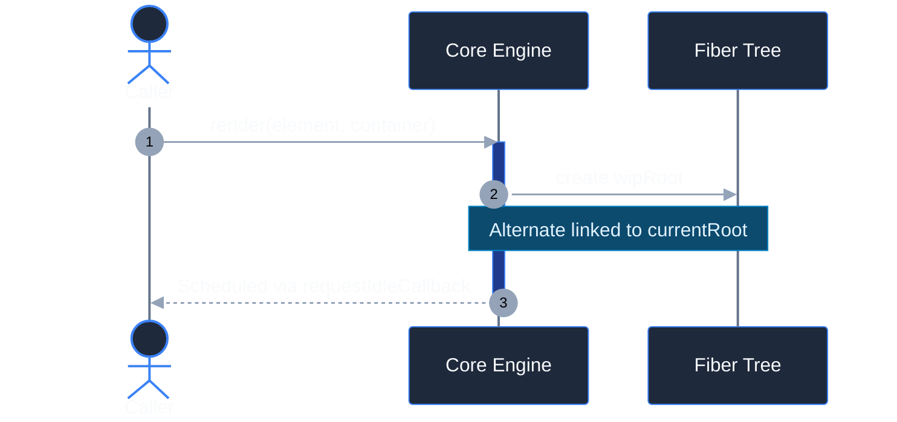
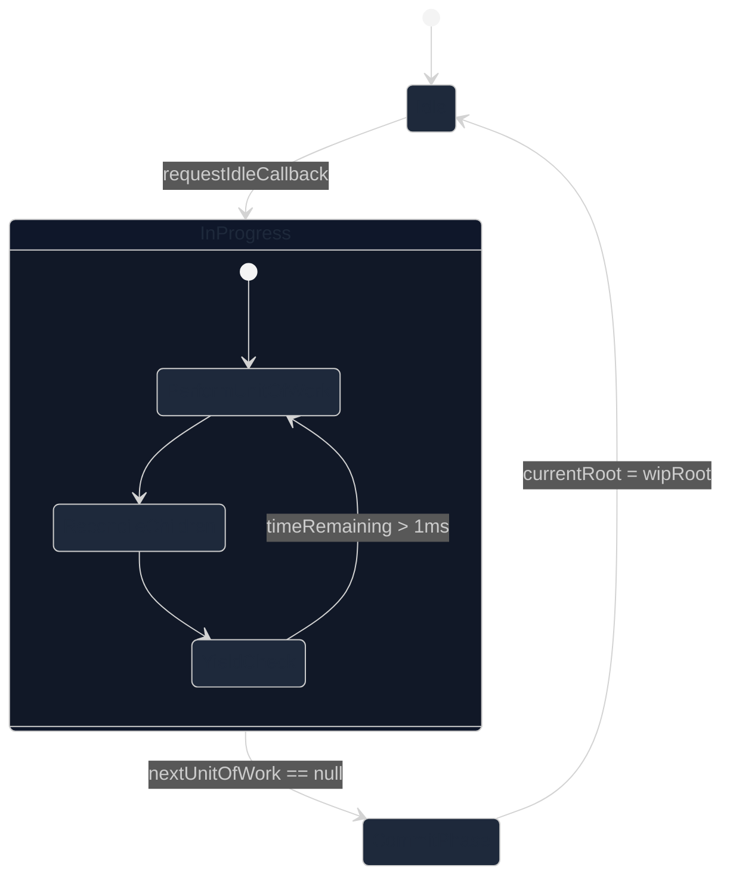

# Mermaid Dark Theme Diagram Templates

Ready-to-use snippets for common diagram types pre-configured for dark theme environments.

---

## 1. Flowchart / Architecture Template

```mermaid
flowchart TD
    %% Global Dark Classes
    classDef default fill:#1e293b,stroke:#475569,stroke-width:1.5px,color:#f8fafc;
    classDef primary fill:#1e3a8a,stroke:#3b82f6,stroke-width:2px,color:#eff6ff;
    classDef success fill:#064e3b,stroke:#10b981,stroke-width:2px,color:#ecfdf5;
    classDef warning fill:#78350f,stroke:#f59e0b,stroke-width:2px,color:#fef3c7;
    classDef danger  fill:#881337,stroke:#f43f5e,stroke-width:2px,color:#ffe4e6;
    classDef neutral fill:#0f172a,stroke:#334155,stroke-width:1.5px,color:#94a3b8;

    subgraph Client ["Client Layer"]
        UserAction["User Click Event"]:::primary
    end

    subgraph Core ["Engine Processing"]
        WorkLoop{"workLoop() Time Remaining?"}:::warning
        PerformWork["performUnitOfWork()"]:::default
        Reconcile["reconcileChildren()"]:::primary
        Commit["commitRoot()"]:::success
    end

    subgraph Output ["Target DOM"]
        RealDOM["document.body"]:::neutral
    end

    UserAction --> WorkLoop
    WorkLoop -->|"Yes (> 1ms)"| PerformWork
    PerformWork --> Reconcile
    WorkLoop -->|"No (Done)"| Commit
    Commit --> RealDOM

    style Client fill:#0f172a,stroke:#334155,stroke-width:1.5px;
    style Core fill:#111827,stroke:#374151,stroke-width:1.5px;
    style Output fill:#0f172a,stroke:#334155,stroke-width:1.5px;
    linkStyle default stroke:#94a3b8,stroke-width:1.5px;
```

---

## 2. Sequence Diagram Template

---

## 3. State Diagram Template

