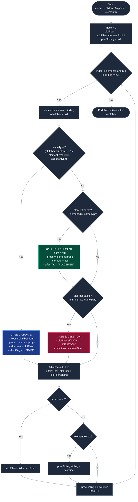
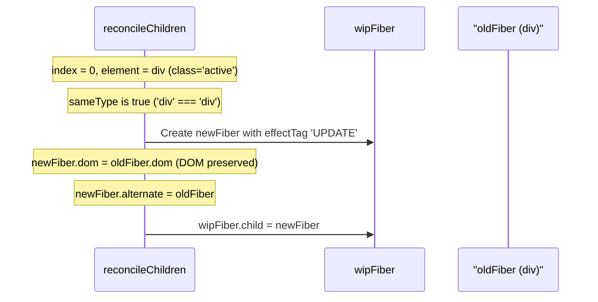

```mermaid
flowchart LR
    subgraph Tag ["effectTag from reconcileChildren"]
        T1["PLACEMENT"]
        T2["UPDATE"]
        T3["DELETION"]
    end

    subgraph Action ["DOM Mutation in commitWork"]
        A1["domParent.appendChild(fiber.dom)"]
        A2["updateDom(dom, prevProps, nextProps)"]
        A3["domParent.removeChild(fiber.dom)"]
    end

    T1 --> A1
    T2 --> A2
    T3 --> A3

    classDef placement fill:#064e3b,stroke:#10b981,stroke-width:2px,color:#ecfdf5;
    classDef update fill:#1e3a8a,stroke:#3b82f6,stroke-width:2px,color:#eff6ff;
    classDef deletion fill:#881337,stroke:#f43f5e,stroke-width:2px,color:#ffe4e6;
    class T1,A1 placement;
    class T2,A2 update;
    class T3,A3 deletion;
    style Tag fill:#0f172a,stroke:#334155,stroke-width:1.5px;
    style Action fill:#0f172a,stroke:#334155,stroke-width:1.5px;
    linkStyle default stroke:#94a3b8,stroke-width:1.5px;
```

# Reconcile Children: Step-by-Step Architecture & Code Logic Walkthrough

This document provides a comprehensive, step-by-step architectural and line-by-line code walkthrough of [`reconcileChildren`](file:///home/longporters/Development/practices/practice-own-react/own-react/src/core/dom/reconcile.js#L1-L64), the core diffing engine of our React implementation, complementing [reconciliation.md](file:///home/longporters/Development/practices/practice-own-react/own-react/src/core/dom/reconciliation.md).

---

## 1. Executive Summary & Objective

In a naive rendering engine, triggering a re-render destroys the existing DOM and rebuilds it from scratch using `appendChild`, leading to massive performance loss, loss of focus, broken CSS animations, and flickering.

The diffing engine solves this by comparing the **previous fiber tree** (`wipFiber.alternate`) with the **new React Elements descriptor array** (`elements = wipFiber.props.children`).

```
                ┌─────────────────────────────────────────────────────────┐
                │                       INPUTS                            │
                │  1. wipFiber: Current parent fiber being processed      │
                │  2. elements: New child React element descriptors       │
                │  3. wipFiber.alternate.child: Old child fibers          │
                └────────────────────────────┬────────────────────────────┘
                                             │
                                             ▼
                             reconcileChildren(wipFiber, elements)
                                             │
                                             ▼
                ┌─────────────────────────────────────────────────────────┐
                │                       OUTPUTS                           │
                │  1. New child fiber tree linked via LCRS pointers       │
                │  2. Nodes tagged: "UPDATE", "PLACEMENT", or "DELETION"  │
                │  3. deletions array populated for the Commit Phase      │
                └─────────────────────────────────────────────────────────┘
```

---

## 2. Architectural Mental Model

### 2.1 Double Buffering & The `alternate` Pointer

Our engine uses a **double buffering** technique:
- `currentRoot`: The Fiber tree committed to the real DOM on screen.
- `wipRoot` / `wipFiber`: The Work-In-Progress tree currently being constructed in memory.

Every fiber in `wipRoot` mirrors a fiber in `currentRoot` through the `.alternate` pointer.

```mermaid
flowchart TD
    subgraph CurrentRoot ["Current Root (Screen)"]
        OldParent["oldFiber (div)"]
        OldChild1["oldChild 1 (h1)"]
        OldChild2["oldChild 2 (p)"]

        OldParent -->|"child"| OldChild1
        OldChild1 -->|"sibling"| OldChild2
    end

    subgraph WipRoot ["Wip Root (In Memory)"]
        WipParent["wipFiber (div)"]
        NewChild1["newFiber 1 (h1)"]
        NewChild2["newFiber 2 (span)"]

        WipParent -->|"child"| NewChild1
        NewChild1 -->|"sibling"| NewChild2
    end

    WipParent -. "alternate" .-> OldParent
    NewChild1 -. "alternate" .-> OldChild1
    NewChild2 -. "alternate: null" .-> OldChild2

    classDef old fill:#881337,stroke:#f43f5e,stroke-width:1.5px,color:#ffe4e6;
    classDef wip fill:#064e3b,stroke:#10b981,stroke-width:1.5px,color:#ecfdf5;
    class OldParent,OldChild1,OldChild2 old;
    class WipParent,NewChild1,NewChild2 wip;
    style CurrentRoot fill:#0f172a,stroke:#334155,stroke-width:1.5px;
    style WipRoot fill:#0f172a,stroke:#334155,stroke-width:1.5px;
    linkStyle default stroke:#94a3b8,stroke-width:1.5px;
```



### 2.2 Data Structure Mismatch: Array vs. Linked List

Reconciliation reconciles two fundamentally different data structures:

| Data Source | Structure | Traversal Mechanism |
| :--- | :--- | :--- |
| **New Elements** (`elements`) | Flat Array | Array Index `elements[index]` |
| **Old Fibers** (`oldFiber`) | Left-Child Right-Sibling (LCRS) Linked List | Pointer `oldFiber = oldFiber.sibling` |

```text
New Elements:   [ Element 0,        Element 1,        Element 2 ]   (Array)
                     │                   │                 │
                   diff                diff              diff
                     │                   │                 │
                     ▼                   ▼                 ▼
Old Fibers:     oldFiber.child ───► .sibling ──────► .sibling       (Linked List)
```

---

## 3. High-Level Flowchart of `reconcileChildren`

Below is the decision matrix and lifecycle for each iteration inside the `while` loop:



---

## 4. Step-by-Step Code Walkthrough

Let's dissect [`src/core/dom/reconcile.js`](file:///home/longporters/Development/practices/practice-own-react/own-react/src/core/dom/reconcile.js) block by block.

### Phase 1: Initialization & Baseline Setup

Lines 1–5 in [`reconcile.js`](file:///home/longporters/Development/practices/practice-own-react/own-react/src/core/dom/reconcile.js#L1-L5):

```javascript
export function reconcileChildren(wipFiber, elements) {
  let index = 0;
  // Get the first child of the old fiber from alternate
  let oldFiber = wipFiber.alternate && wipFiber.alternate.child;
  let prevSibling = null;
```

- **`index = 0`**: Iterates through the new React elements array (`elements[0]`, `elements[1]`, etc.).
- **`oldFiber = wipFiber.alternate && wipFiber.alternate.child`**:
  - Retrieves the first child of the previous render tree from `wipFiber.alternate`.
  - If this is a first mount (initial render), `wipFiber.alternate` is `null`, making `oldFiber = null`.
- **`prevSibling = null`**: Tracks the newly created fiber from the previous loop iteration so we can connect `.sibling` pointers.

---

### Phase 2: Dual Iteration Loop

Line 8 in [`reconcile.js`](file:///home/longporters/Development/practices/practice-own-react/own-react/src/core/dom/reconcile.js#L8):

```javascript
  while (index < elements.length || oldFiber != null) {
    const element = elements[index];
    let newFiber = null;
```

Why use `||` instead of `&&`?
1. **`elements.length > oldFiber count`**: New children were added. When `oldFiber` becomes `null`, the loop must continue to instantiate the remaining new elements as `"PLACEMENT"`.
2. **`elements.length < oldFiber count`**: Children were removed. When `index >= elements.length` (`element === undefined`), the loop must continue traversing remaining `oldFiber` nodes to tag them as `"DELETION"`.
3. **`elements.length === oldFiber count`**: Both terminate at the same time.

---

### Phase 3: The Diffing Test (`sameType`)

Line 13 in [`reconcile.js`](file:///home/longporters/Development/practices/practice-own-react/own-react/src/core/dom/reconcile.js#L13):

```javascript
    const sameType = oldFiber && element && element.type === oldFiber.type;
```

This boolean check determines whether the DOM node can be **recycled** or must be **destroyed and recreated**:
- Both `oldFiber` and `element` must exist.
- Their `type` (e.g. `'div'`, `'h1'`, `'p'`) must be strictly identical (`===`).

---

### Phase 4: Case 1 — UPDATE (Same Type)

Lines 15–26 in [`reconcile.js`](file:///home/longporters/Development/practices/practice-own-react/own-react/src/core/dom/reconcile.js#L15-L26):

```javascript
    // CASE 1: UPDATE
    // Same type -> Keep the existing DOM node, update props
    if (sameType) {
      newFiber = {
        type: oldFiber.type,
        props: element.props,
        dom: oldFiber.dom, // REUSE OLD DOM NODE
        parent: wipFiber,
        alternate: oldFiber,
        effectTag: "UPDATE",
      };
    }
```

```
[Old Fiber] (div, id="old") ─── dom: HTMLDivElement
                                         ▲
                                         │ (reused!)
[New Fiber] (div, id="new") ─── dom: HTMLDivElement  (effectTag: "UPDATE")
```

**Key Takeaways**:
1. **DOM Recycling**: `dom: oldFiber.dom`. We avoid calling `document.createElement`.
2. **Fresh Props**: `props: element.props`. The new fiber gets the latest props (new text, updated attributes, new event listeners).
3. **Alternate Linked**: `alternate: oldFiber`. During the Commit Phase, [`updateDom(dom, prevProps, nextProps)`](file:///home/longporters/Development/practices/practice-own-react/own-react/src/core/dom/dom.js#L44-L78) compares `fiber.alternate.props` with `fiber.props` to apply fine-grained attribute diffs.
4. **Tagged `"UPDATE"`**: Signals `commitWork` to invoke `updateDom`.

---

### Phase 5: Case 2 — PLACEMENT (New or Changed Type)

Lines 28–39 in [`reconcile.js`](file:///home/longporters/Development/practices/practice-own-react/own-react/src/core/dom/reconcile.js#L28-L39):

```javascript
    // CASE 2: PLACEMENT
    // Different type or new element -> Needs a brand-new DOM node
    if (element && !sameType) {
      newFiber = {
        type: element.type,
        props: element.props,
        dom: null,
        parent: wipFiber,
        alternate: null,
        effectTag: "PLACEMENT",
      };
    }
```

**Occurs When**:
- A new element was added at this position (`oldFiber` is `null`).
- The element at this position changed type (e.g., from `<h1>` to `<p>`).

**Key Takeaways**:
1. **`dom: null`**: The DOM node doesn't exist yet; it will be created in [`performUnitOfWork`](file:///home/longporters/Development/practices/practice-own-react/own-react/src/core/dom/index.js#L76-L92) via `createDom(fiber)`.
2. **`alternate: null`**: This is a brand new node with no previous history.
3. **Tagged `"PLACEMENT"`**: Signals `commitWork` to execute `domParent.appendChild(fiber.dom)`.

---

### Phase 6: Case 3 — DELETION (Removed or Changed Type)

Lines 41–46 in [`reconcile.js`](file:///home/longporters/Development/practices/practice-own-react/own-react/src/core/dom/reconcile.js#L41-L46):

```javascript
    // CASE 3: DELETION
    // Old fiber exists, but no corresponding new element -> Delete old node
    if (oldFiber && !sameType) {
      oldFiber.effectTag = "DELETION";
      deletions.push(oldFiber); // Track node for Commit Phase
    }
```

**Occurs When**:
- There is no new element (`element === undefined`).
- The type changed (the old DOM node of type `A` cannot be used for new element of type `B`).

> [!IMPORTANT]
> **Why do we need the `deletions` array?**
>
> Deleted fibers are **excluded from the new WIP tree** (they are not attached to `wipFiber.child` or any `.sibling`).
> Because [`commitRoot`](file:///home/longporters/Development/practices/practice-own-react/own-react/src/core/dom/index.js#L4-L14) only walks `wipRoot.child`, it would never encounter deleted nodes!
> Therefore, we push them into a separate `deletions` array, and `commitRoot()` processes deletions before mounting/updating:
> ```javascript
> function commitRoot() {
>   deletions.forEach(commitWork); // Commit removals first!
>   commitWork(wipRoot.child);
>   ...
> }
> ```

---

### Phase 7: Pointer Advancement (Old Tree)

Lines 48–51 in [`reconcile.js`](file:///home/longporters/Development/practices/practice-own-react/own-react/src/core/dom/reconcile.js#L48-L51):

```javascript
    // Advance to the next sibling in the old tree
    if (oldFiber) {
      oldFiber = oldFiber.sibling;
    }
```

- Always moves `oldFiber` forward to its `.sibling` if it exists.
- In the next iteration, the next old sibling will be compared with the next new element (`elements[index + 1]`).

---

### Phase 8: LCRS Tree Assembly

Lines 53–63 in [`reconcile.js`](file:///home/longporters/Development/practices/practice-own-react/own-react/src/core/dom/reconcile.js#L53-L63):

```javascript
    // Link into LCRS structure
    if (index === 0) {
      wipFiber.child = newFiber;
    } else if (element) {
      // Always start from index > 0
      prevSibling.sibling = newFiber;
    }

    prevSibling = newFiber;
    index++;
```

This step builds the single-parent, single-sibling pointers of the Fiber architecture:

1. **`index === 0`**:
   The very first child must be directly referenced by the parent fiber:
   `wipFiber.child = newFiber`.
2. **`index > 0 && element`**:
   Every subsequent child is chained horizontally to the previous child:
   `prevSibling.sibling = newFiber`.
3. **`prevSibling = newFiber`**:
   Saves current `newFiber` so the next child can point back to it.
4. **`index++`**:
   Advances the array pointer for the next loop cycle.

---

## 5. Walkthrough Scenarios & Visual Trace

### Scenario A: Prop Update (`<div>hello</div>` $\rightarrow$ `<div class="active">hello</div>`)



---

### Scenario B: Type Replacement (`<h1>Title</h1>` $\rightarrow$ `<p>Title</p>`)

When an element's type changes, **both Case 2 (PLACEMENT) and Case 3 (DELETION) trigger**:

```text
Iteration 0:
  - oldFiber: { type: 'h1', dom: HTMLHeadingElement }
  - element:  { type: 'p', props: { ... } }
  - sameType: false

Actions Taken:
  1. Case 2: Create newFiber { type: 'p', dom: null, effectTag: 'PLACEMENT' }
  2. Case 3: oldFiber.effectTag = 'DELETION' -> pushed to deletions[]
  3. Wire: wipFiber.child = newFiber
  4. Advance: oldFiber = oldFiber.sibling, index = 1
```

During the Commit Phase:
1. `commitWork(oldFiber)` runs $\rightarrow$ `parentDom.removeChild(h1)`.
2. `commitWork(newFiber)` runs $\rightarrow$ `createDom(newFiber)` $\rightarrow$ `parentDom.appendChild(p)`.

---

### Scenario C: Element Deletion (List shrunk from 3 items to 2 items)

Old tree has 3 items: `[li_1, li_2, li_3]`. New elements array has 2 items: `[li_1, li_2]`.

```mermaid
flowchart TD
    subgraph Iter0 ["Iteration 0 (index = 0)"]
        Match0["Compare: li_1 vs li_1<br/>sameType: true"]:::caseUpdate
        Action0["newFiber created<br/>effectTag: 'UPDATE'"]:::caseUpdate
        Match0 --> Action0
    end

    subgraph Iter1 ["Iteration 1 (index = 1)"]
        Match1["Compare: li_2 vs li_2<br/>sameType: true"]:::caseUpdate
        Action1["newFiber created<br/>effectTag: 'UPDATE'"]:::caseUpdate
        Match1 --> Action1
    end

    subgraph Iter2 ["Iteration 2 (index = 2)"]
        Match2["Compare: li_3 vs undefined<br/>sameType: false"]:::caseDeletion
        Action2["oldFiber.effectTag: 'DELETION'<br/>deletions.push(li_3)"]:::caseDeletion
        Match2 --> Action2
    end

    Iter0 --> Iter1
    Iter1 --> Iter2

    classDef caseUpdate fill:#1e3a8a,stroke:#3b82f6,stroke-width:2px,color:#eff6ff;
    classDef caseDeletion fill:#881337,stroke:#f43f5e,stroke-width:2px,color:#ffe4e6;
    style Iter0 fill:#0f172a,stroke:#334155,stroke-width:1.5px;
    style Iter1 fill:#0f172a,stroke:#334155,stroke-width:1.5px;
    style Iter2 fill:#0f172a,stroke:#334155,stroke-width:1.5px;
    linkStyle default stroke:#94a3b8,stroke-width:1.5px;
```



---

## 6. Downstream Execution: The Commit Phase

Once `reconcileChildren` labels all nodes, how are these tags consumed?

In [`src/core/dom/index.js`](file:///home/longporters/Development/practices/practice-own-react/own-react/src/core/dom/index.js#L20-L36):

```javascript
function commitWork(fiber) {
  if (!fiber) return;

  const domParent = fiber.parent.dom;

  if (fiber.effectTag === "PLACEMENT" && fiber.dom != null) {
    // 1. Insert new DOM element
    domParent.appendChild(fiber.dom);
  } else if (fiber.effectTag === "UPDATE" && fiber.dom != null) {
    // 2. Diff attributes and event listeners in place
    updateDom(fiber.dom, fiber.alternate.props, fiber.props);
  } else if (fiber.effectTag === "DELETION") {
    // 3. Remove obsolete DOM element
    domParent.removeChild(fiber.dom);
    return;
  }

  commitWork(fiber.child);
  commitWork(fiber.sibling);
}
```



---

## 7. Comparative Quick Reference

| Feature | `CASE 1: UPDATE` | `CASE 2: PLACEMENT` | `CASE 3: DELETION` |
| :--- | :--- | :--- | :--- |
| **Condition** | `sameType === true` | `element && !sameType` | `oldFiber && !sameType` |
| **`dom` Node** | Reused: `oldFiber.dom` | Created later (`dom: null`) | Removed from parent DOM |
| **`alternate`** | Linked: `oldFiber` | `null` | N/A (`oldFiber` itself) |
| **In WIP Tree?** | Yes (`wipFiber.child`/`.sibling`) | Yes (`wipFiber.child`/`.sibling`) | **No** (pushed to `deletions[]`) |
| **Commit Action**| `updateDom(dom, prev, next)` | `domParent.appendChild(dom)`| `domParent.removeChild(dom)` |
| **Performance** | **High**: Zero DOM creation | **Medium**: Single DOM mount | **Fast**: Direct DOM node removal |

---

## 8. Summary Checklist

- [x] Initialized dual traversal using array index (`index`) and linked-list pointer (`oldFiber`).
- [x] Evaluated `sameType = oldFiber && element && element.type === oldFiber.type`.
- [x] Handled **UPDATE** by retaining `oldFiber.dom` and linking `alternate`.
- [x] Handled **PLACEMENT** by creating a fresh fiber node tagged `"PLACEMENT"`.
- [x] Handled **DELETION** by tagging `oldFiber` and recording it in the `deletions` array.
- [x] Connected all new fibers into an LCRS tree structure (`wipFiber.child` and `prevSibling.sibling`).
