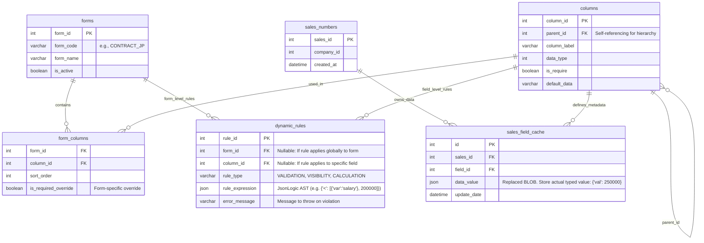

# Agent Guidance: CRM Dynamic Rule Engine Mock Server

## 1. Objective & Tech Stack

This repository serves as a lightweight Node.js mock server to test Dynamic Forms, EAV patterns, and Business Rule Engine concepts prior to implementing them in the main Java Spring Boot service.

- **Runtime & Framework:** [Bun.js](https://bun.sh/) + [Elysia.js](https://elysiajs.com/) + TypeScript (Ultra-fast execution, native TS support).
- **Database & ORM:** MySQL 8.0+ (Mandatory for native JSON support) + Prisma ORM.
- **Caching:** Redis (For caching compiled JsonLogic rules and schemas).
- **Infrastructure:** Docker & Docker Compose.

---

## 2. Infrastructure Setup (Docker Compose)

Create a `docker-compose.yml` at the root directory to spin up MySQL and Redis.

```yaml
version: "3.8"
services:
  mysql:
    image: mysql:8.0
    environment:
      MYSQL_ROOT_PASSWORD: rootpassword
      MYSQL_DATABASE: crm_mock_db
    ports:
      - "3306:3306"
    volumes:
      - mysql_data:/var/lib/mysql

  redis:
    image: redis:alpine
    ports:
      - "6379:6379"

volumes:
  mysql_data:
```

---

## 3. Database Architecture (ERD)

The following schema maps the legacy EAV design into a modern, queryable structure. We introduce `forms` to group fields and `dynamic_rules` to store `JsonLogic` expressions, while upgrading the `sales_field_cache` to utilize JSON instead of BLOB.



---

## 4. Project Structure (RESTful API Standard)

Keep the architecture modular. Elysia works best with a plugin-based routing system.

```text
src/
├── config/
│   ├── env.ts            # Environment variables validation
│   ├── db.ts             # Prisma client initialization
│   └── redis.ts          # Redis client initialization
├── controllers/
│   ├── form.controller.ts
│   ├── rule.controller.ts
│   └── submission.controller.ts # Handles payload merging and Rule Engine trigger
├── services/
│   ├── eav.service.ts    # Merges rows into flat JSON objects
│   └── rule.service.ts   # Executes JsonLogic against the flattened payload
├── routes/
│   ├── form.routes.ts
│   └── api.ts            # Main router aggregator
├── schemas/
│   └── payload.schema.ts # Elysia Typebox validation (System Validation)
├── utils/
│   ├── response.ts       # Standardized API response formatter
│   └── error-handler.ts  # Global exception catcher
└── index.ts              # App entry point

```

---

## 5. Standard Response Utilities

Create standard utility functions to ensure all API responses share a consistent format across the application.

**File:** `src/utils/response.ts`

```typescript
export interface ApiResponse<T any> {
  success: boolean;
  message: string;
  data?: T;
  meta?: any;
  error?: {
    code: string | number;
    details?: any;
  };
}

export const HttpResponse = {
  success: <T>(data: T, message = 'Success', meta?: any): ApiResponse<T> => ({
    success: true,
    message,
    data,
    meta,
  }),

  error: (message: string, code: number | string = 500, details?: any): ApiResponse => ({
    success: false,
    message,
    error: {
      code,
      details,
    },
  }),
};

```

**Usage Example in Controller:**

```typescript
import { HttpResponse } from "../utils/response";

export const submitContract = async ({ body, set }: any) => {
  try {
    // 1. Process Payload
    // 2. Evaluate Rule Engine
    const result = await RuleService.evaluate(body);

    if (!result.isValid) {
      set.status = 400;
      return HttpResponse.error(result.errorMessage, "RULE_VIOLATION");
    }

    set.status = 201;
    return HttpResponse.success(
      result.data,
      "Contract validated and saved successfully",
    );
  } catch (err: any) {
    set.status = 500;
    return HttpResponse.error("Internal Server Error", 500, err.message);
  }
};
```

---

## 6. Initialization Commands

Execute the following commands to bootstrap the mock server:

```bash
# 1. Initialize Bun project
bun init

# 2. Install Elysia framework and core plugins
bun add elysia @elysiajs/cors @elysiajs/swagger

# 3. Install Database & Redis Tools
bun add prisma @prisma/client ioredis json-logic-js

# 4. Initialize Prisma
bunx prisma init

# 5. Start DB via Docker
docker-compose up -d

# 6. Run Dev Server
bun run --watch src/index.ts

```

```

```
