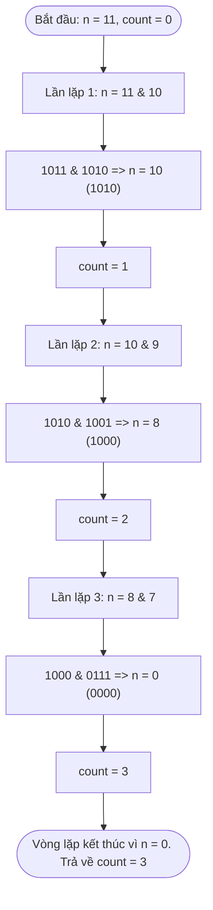

# Hướng Dẫn Học Thuật Toán: Hamming Weight (Đếm Số Bit 1)

Chào mừng bạn đến với hướng dẫn chi tiết về bài toán **Hamming Weight** (còn gọi là *Number of 1 Bits* hay *Đếm số lượng set bits*). Tài liệu này sẽ giúp bạn hiểu sâu sắc từ lý thuyết cơ bản đến các phương pháp tối ưu hóa bitwise cấp độ doanh nghiệp.

---

## 1. WHAT: Hamming Weight Là Gì?

**Hamming Weight** của một chuỗi hoặc một số là số lượng ký tự khác ký tự rỗng (thường là số lượng ký tự `1` trong hệ nhị phân) có trong biểu diễn của nó. 

Đối với một số nguyên dương $N$ trong máy tính:
*   Nó sẽ được lưu trữ dưới dạng một chuỗi gồm các bit `0` và `1` (biểu diễn nhị phân).
*   **Hamming Weight** chính là tổng số lượng các bit `1` (được gọi là **set bits**) trong chuỗi nhị phân đó.

> [!NOTE]
> Thuật ngữ này được đặt tên theo **Richard Hamming**, một nhà toán học và khoa học máy tính người Mỹ tiên phong, người đã đặt nền móng cho lý thuyết mã hóa và truyền thông tin.

### Ví Dụ Minh Họa:
*   **Ví dụ 1**: $num = 8$
    *   Biểu diễn nhị phân: `1000`
    *   Số lượng bit `1`: **1** $\rightarrow$ Hamming Weight = `1`
*   **Ví dụ 2**: $num = 9$
    *   Biểu diễn nhị phân: `1001`
    *   Số lượng bit `1`: **2** $\rightarrow$ Hamming Weight = `2`
*   **Ví dụ 3**: $num = 123$
    *   Biểu diễn nhị phân: `1111011`
    *   Số lượng bit `1`: **6** $\rightarrow$ Hamming Weight = `6`

---

## 2. WHY: Tại Sao Thuật Toán Này Lại Quan Trọng?

Việc đếm số bit `1` tưởng chừng như đơn giản nhưng lại là một trong những phép toán nền tảng của khoa học máy tính, có ứng dụng cực kỳ rộng rãi:

1.  **Truyền Thông mạng & Phát Hiện Lỗi (Error Detection)**:
    *   Được sử dụng trong thuật toán tính **Hamming Distance** để đo lường sự khác biệt giữa hai gói tin, giúp phát hiện và sửa lỗi trong quá trình truyền dữ liệu qua mạng.
2.  **Mật Mã Học (Cryptography)**:
    *   Nhiều thuật toán mã hóa khóa công khai và hàm băm sử dụng phép đếm set bits để tính toán độ phức tạp hoặc entropy của khóa.
3.  **Tối Ưu Hóa Trạng Thái (Bitmasking & Game Development)**:
    *   Trong lập trình game hoặc hệ thống hiệu năng cao, ta thường nén các trạng thái (ví dụ: các ô trên bàn cờ vua, danh sách vật phẩm nhân vật đang sở hữu) vào một số nguyên 64-bit dưới dạng các cờ (flags). Việc đếm số bit `1` giúp xác định nhanh số lượng trạng thái đang kích hoạt.

---

## 3. HOW: 3 Phương Pháp Tính Toán Bit (Đơn giản đến Siêu tối ưu)

Dưới đây là bảng so sánh chi tiết 3 phương pháp tiếp cận phổ biến nhất:

| Phương pháp | Time Complexity | Space Complexity | Ưu điểm | Nhược điểm |
| :--- | :--- | :--- | :--- | :--- |
| **1. Binary String (Chuỗi)** | $O(\log N)$ | $O(\log N)$ | Trực quan, dễ viết, dễ đọc. | Chậm, tốn bộ nhớ để tạo chuỗi và mảng trung gian. |
| **2. Bitwise Shift (Dịch bit)** | $O(\text{bits}) \approx O(1)$ | $O(1)$ | Không tốn thêm bộ nhớ, chuẩn tư duy bitwise cơ bản. | Phải duyệt qua toàn bộ các bit (kể cả bit 0), tối đa 32/64 lần lặp. |
| **3. Brian Kernighan (Tối ưu)** | **$O(k)$** *(với $k$ là số bit 1)* | **$O(1)$** | **Cực nhanh**, chỉ lặp qua các bit 1 thực tế, bỏ qua hoàn toàn các bit 0. | Đòi hỏi tư duy toán học và hiểu sâu về phép toán bitwise. |

---

### Chi Tiết Từng Thuật Toán

#### 💡 Cách 1: Sử dụng Chuỗi Nhị Phân (toString)
Chuyển đổi số thành chuỗi nhị phân bằng `.toString(2)` và đếm số lần xuất hiện của ký tự `'1'`.

```typescript
const hammingWeightString = (num: number): number => {
  return num.toString(2).split('1').length - 1;
};
```

---

#### ⚙️ Cách 2: Duyệt từng Bit bằng Phép Dịch Bit (Right Shift)
Ta dùng toán tử `& 1` để kiểm tra bit cuối cùng bên phải có phải là `1` hay không, sau đó dùng phép dịch bit không dấu `>>> 1` để dịch chuyển số sang phải, bỏ qua bit đã kiểm tra.

```typescript
const hammingWeightShift = (num: number): number => {
  let count = 0;
  let n = num;
  while (n !== 0) {
    count += n & 1; // n & 1 trả về 1 nếu bit cuối là 1, ngược lại trả về 0
    n >>>= 1;       // Dịch phải không dấu 1 bit
  }
  return count;
};
```

---

#### 🚀 Cách 3: Thuật Toán Brian Kernighan (Đỉnh Cao Tối Ưu)
Thay vì kiểm tra từng bit một kể cả bit `0`, thuật toán này sử dụng một đặc điểm toán học kỳ diệu của hệ nhị phân: **Phép toán `n & (n - 1)` sẽ luôn xóa đi bit `1` ngoài cùng bên phải của số `n`**.

> [!IMPORTANT]
> **Giải thích công thức toán học `n & (n - 1)`**:
> Khi ta trừ đi `1` từ một số `n`, tất cả các bit nằm bên phải bit `1` cuối cùng (tính từ trái sang phải) bao gồm cả bit `1` đó sẽ bị đảo ngược (`1` thành `0`, `0` thành `1`). 
> Khi thực hiện phép AND (`&`) giữa `n` và `n - 1`, phần phía trước bit `1` cuối cùng vẫn giữ nguyên, còn phần bị đảo ngược sẽ chuyển hoàn toàn thành `0`. Kết quả là bit `1` cuối cùng đã bị triệt tiêu hoàn toàn!

```typescript
const hammingWeightKernighan = (num: number): number => {
  let count = 0;
  let n = num;
  while (n > 0) {
    n = n & (n - 1); // Triệt tiêu bit 1 ngoài cùng bên phải
    count++;         // Tăng biến đếm
  }
  return count;
};
```

---

## 4. Minh Họa Từng Bước Chạy (Visual Walkthrough)

Hãy cùng xem thuật toán **Brian Kernighan** xử lý số **$11$** (Nhị phân là `1011`) như thế nào nhé!



### Bảng trạng thái chi tiết:

| Lần lặp | Giá trị `n` trước khi xử lý | Phép toán `n & (n - 1)` | Kết quả nhị phân | Kết quả thập phân | Biến `count` |
| :---: | :--- | :--- | :--- | :---: | :---: |
| **Khởi tạo**| — | — | `1011` | 11 | 0 |
| **Lần 1** | `1011` | `1011 & 1010` | `1010` | 10 | 1 |
| **Lần 2** | `1010` | `1010 & 1001` | `1000` | 8 | 2 |
| **Lần 3** | `1000` | `1000 & 0111` | `0000` | 0 | 3 |

Như vậy, số `11` có tổng cộng **3** bit `1`. Thuật toán chỉ mất đúng **3 bước lặp** để tính ra kết quả, thay vì phải chạy vòng lặp 32 lần như cách dịch bit thông thường!

---
Chúc bạn học tốt và làm chủ hoàn toàn các kỹ thuật thao tác trên bit!
